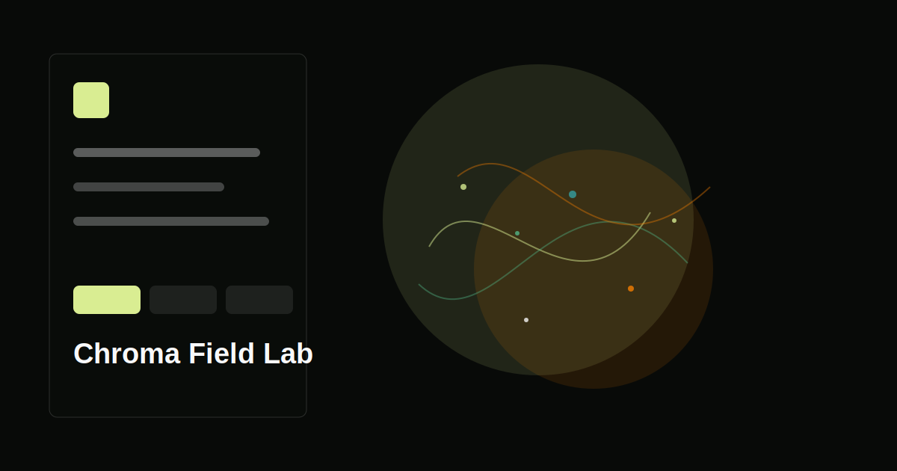

# Chroma Field Lab

A Three.js flow-field particle lab for painting animated chromatic vector fields in the browser.



## What it does

Chroma Field Lab uses a lightweight CPU-updated particle system and Three.js point rendering to create flowing fields that can be tuned, seeded, and exported as PNG stills.

## Features

- Three field modes: curl, magnet, and tide.
- Live controls for particle count, spread, field scale, velocity, attractor strength, depth, and point size.
- Deterministic seeded layouts for repeatable compositions.
- Palette presets designed for bright particles on a charcoal field.
- PNG snapshot export.
- GitHub Pages deployment workflow included.

## Quick start

```bash
npm install
npm run dev
```

## Scripts

- `npm run dev` - start the local Vite server.
- `npm run lint` - run the TypeScript project check.
- `npm run build` - type-check and build.
- `npm run preview` - preview the production bundle.

## Roadmap

- Add field recording to WebM.
- Add pointer interaction so the user can drag attractors.
- Add preset import and export.
- Add a GPU simulation mode for very large particle counts.
